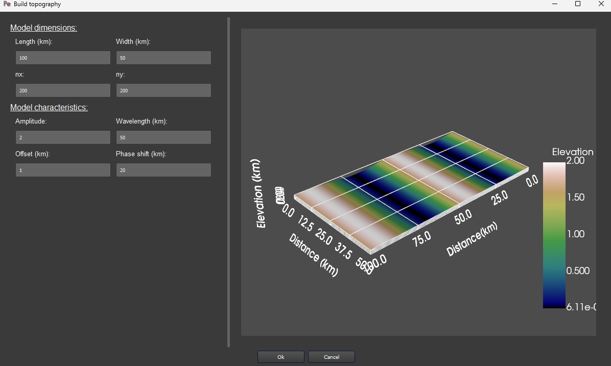
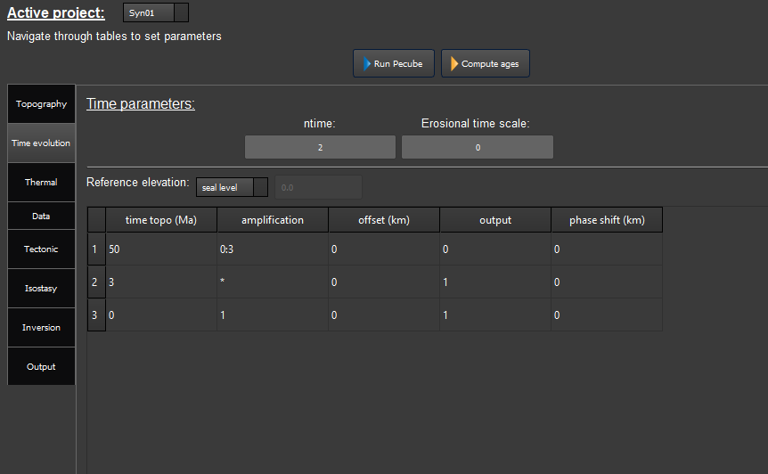
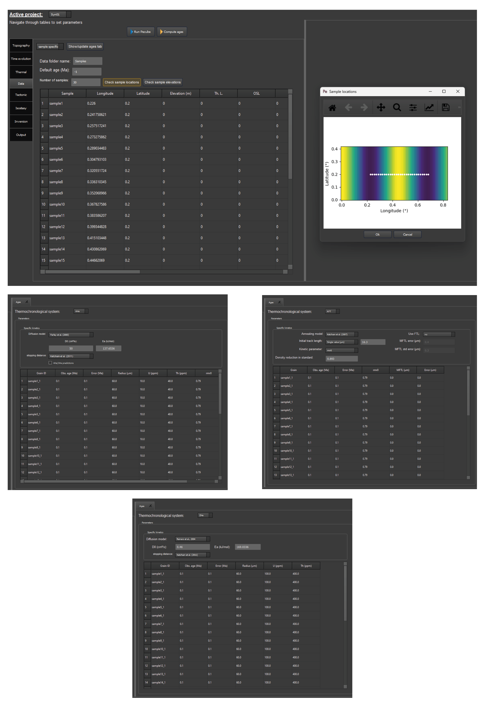
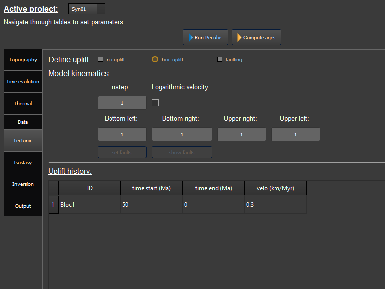
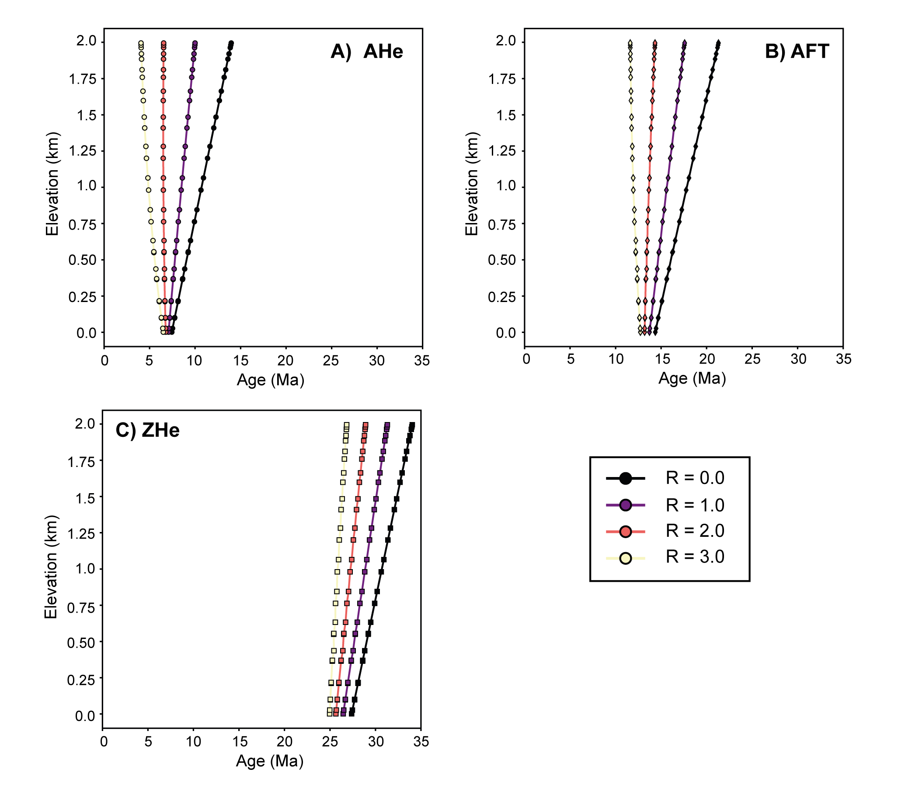

Examples
========

Synthetic example:
-----------------

The effect of relief changes on the age-elevation relationship and apparent exhumation rates (AER)
^^^^^^^^^^^^^^^^^^^^^^^^^^^^^^^^^^^^^^^^^^^^^^^^^^^^^^^^^^^^^^^^^^^^^^^^^^^^^^^^^^^^^^^^^^^^^^^^^^

| A common problem in thermochronology involve resolving the exhumation history of a study area. This can be done by collecting rock samples along nearly vertical profiles, and through the interpretation of age-elevation relationships. However, the presence of a finite amplitude topography can perturbate the underlaying isotherms relevant to thermochronometry systems, leading to bias the exhumation rate extracted from an age-elevation plot. The effect of this perturbation mostly depends on the topographic wavelength and topographic amplitude (Braun, 2002). In this example, we explore how the topographic relief impact the slope of the age-elevation relationship (i.e., the apparent exhumation rate or AER). The example can be loaded from the Pecube project “Syn01”.

| To explore the effect of a change in relief on the AER, we design a synthetic topography with a topographic wavelength of 50 km, and a present-day topography amplitude of 2 km. For the exhumation and topography development history, we assume a constant tectonic uplift rate started 50 Ma up to present-day. We further assume that a topographic relief exists at the start of the model and is in steady-state until 3 Ma, where the relief change to the present-day topography (i.e., 2 km amplitude). We use Pecube in batch mode to explore a range of paleo-relief (i.e., before 3 Ma) ranging from 0 to x3 the present-day relief.

| To setup the Pecube model, create a new project and in the “Topography” tab, click on “build topo…”. A window appears, where you can design a sinusoidal topography. The extent of the model is chosen to be 100x50 km with a horizontal resolution of 500 m. The topography is setup is shown in Figure 1.1.

    *Figure 1.1. Setup for the synthetic topography.*

| Once you click on the ‘Ok’ button (Figure 1.1), the window closes, and the topography is directly loaded within the interface. You can check the input topography by clicking ‘show topography’ in the ‘topography” tab. To speed the computation of the models up you can set nskip = 3. Then, move to the ‘Time evolution’ tab to setup the topography evolution scenario. Two stages are required (ntime = 2, Figure 1.2). We set the reference elevation to ‘sea-level’ (Figure 1.2) and provide the topography history as described above (Figure 1.2), with a specification for the relief amplification factor where we provide a range of value from 0 to x3 times the final topographic relief (Figure 1.2). 

    *Figure 1.2. Topography evolution scenario settings.*

| For the thermal setting of the crust, we assume an initial geotherm of about 30°C/km (basal temperature of 650°C). We let the other parameters with their default values. Then, we consider a temperature at sea-level of 15°C with an atmospheric lapse rate of 6 °C/km.

| To compute age-elevation relationships, we consider synthetic samples along a transect perpendicular to the direction of the main valleys (Figure 1.3). We consider 30 samples distant of 1.5 km from each other (Figure 1.3). For this example, we predict AHe, AFT and Zhe data. We thus set 1 grain per sample for each column corresponding to each thermochronometers. For the (U-Th)/He thermochronometers, we consider the diffusion models from Farley et al. (2000) for apatite and from Reiners et al. (2004) for zircon. For the apatite fission track, we use the annealing model from Ketcham et al. (2007) and assume a kinetic parameter rmr0 = 0.79 (i.e., Durango apatite).

    *Figure 1.3. Provide synthetic samples locations and set thermochronometers.*

| In a next step, we set the tectonic scenario in the “Tectonic” tab (Figure 1.4). We consider a uniform bloc uplift and a constant uplift rate of 0.3 km/Myr since 50 Ma. Finally, to run Pecube in batch mode, set the inversion mode to “batch” in the “Inversion tab”. Then, we set the number of intervals to 3 to explore a range of paleo-relief from 0 to x3 with a step of 1. To run the batch, click on “Run Pecube”.
Once the run has finished, the resulting age-elevation profiles can be plotted. Switch to the chart part of the interface and load the Pecube project. In the list of plots, find and click on “Batch results”. Doing this open a window asking you to choose the type of plot and the thermochronometers you wish to show. The resulting age-elevation profiles are shown in Figure 1.5.

    *Figure 1.4. Tectonic scenario settings.*

| A first observation is that most of the apparent exhumation rate (AER) overestimate the input tectonic uplift rate of 0.3 km/Myr for the three thermochronometers. Only the models considering an increase of relief from 3 Ma to present-day (i.e., R = 0.0, Figure 1.5) show AER = 0.3 km/Myr for the three thermochronometers. This is because all thermochronometers passed through their closure temperature before 3 Ma when the topography and resulting isotherm are flat. Considering a steady-state topography along the 50 Ma exhumation (i.e., R= 1.0, Figure 1.5) leads to overestimate the true exhumation (E = 0.3 km/Myr) for the three thermochronometers although the difference decreases for higher-temperature thermochronometers (AERAHe = 0.7 km/Myr, AERAFT = 0.52 km/Myr, AERZHe = 0.4 km/Myr). The overestimated of the exhumation rate from the low-temperature thermochronometers is a direct consequence of the perturbation of isotherms below the finite topography. This perturbation decreases exponentially with depth (Braun et al., 2002).

    *Figure 1.5. Predicted age-elevation profiles for various change of relief (R).*

| Finally, a significant decrease of relief reverses the age-elevation profile for the lower-temperature thermochronometers (i.e., AHe and AFT, R = 3.0 in Figure 1.5) showing younger ages on the summits and older ages on the valley bottoms. This effect has been described by Braun (2002) and is a consequence of bringing the summit elevations closer to the closure depth of the low-temperature thermochronometers. However, the reverse of the age-elevation relationship is highly dependent on 2 main factors. First, the larger topographic wavelength the higher the relief decrease signal will be recorded in an age-elevation plot. The isotherms below a high topographic wavelength tend to follow the topography contours leading to reduce the distance of closure depths to the surface beneath the valley and the summits (Braun, 2002). Second, the relief decrease has to be at least 2-3 times higher than the background exhumation rate due to the depth of the closure isotherm for the AFT and AHe systems (70-110 °C, Valla et al., 2010).

References:

.. [Sternai-et-al-2013] Sternai, P., Herman, F., Valla, P. G., & Champagnac, J. D. (2013). Spatial and temporal variations of glacial erosion in the Rhône valley (Swiss Alps): Insights from numerical modeling. Earth and Planetary Science Letters, 368, 119-131.

.. [Valla-et-al-2012] Valla, P. G., van der Beek, P. A., Shuster, D. L., Braun, J., Herman, F., Tassan‐Got, L., & Gautheron, C. (2012). Late Neogene exhumation and relief development of the Aar and Aiguilles Rouges massifs (Swiss Alps) from low‐temperature thermochronology modeling and 4He/3He thermochronometry. Journal of Geophysical Research: Earth Surface, 117(F1).
