==============
Extended usage
==============

.. _runPecube:

---------------------------
Create a new Pecube project
---------------------------

To create and run a new Pecube project, go to *New input file* or press *Crtl+N* (*3*, see :doc:`introduction`),
a window pops up and asks you to provide the name of the new project (Figure *1*). Pecube requires that the project name be 5 characters length.
After clicking the “Ok” button (Figure *2*), you will be able to provide and set all of the Pecube input parameters for your project.
  
.. figure:: ../images/New_Project.png
  :scale: 60
  :align: center

  *Figure 1. Enter a new project name. This window shows up when clicking on the "New input file" action button.*

The window should look like Figure *2*. On the top left, you could find and access all the projects you have loaded into the interface,
and thus navigate through their respective parameters. The right part of the interface will host extra input parameters described in the next sections.

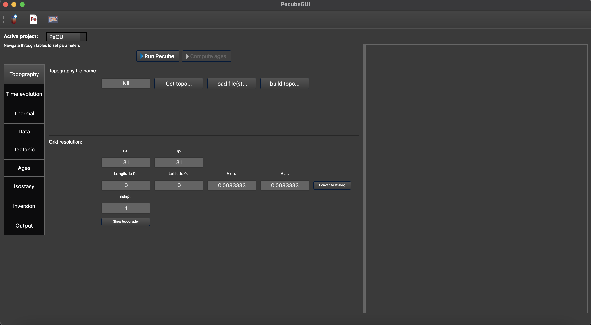

  *Figure 2. Tab to set up the input parameters for Pecube. On the top left, you can check the name of your project (here: ‘PeGUI’)*
  
  
The input parameters are organised into categories similar to what is referenced in the Pecube’s user guide (in 'Pecube/docs/Pecube.pdf'). All the parameters are sorted in *8* categories: *Topography*, *Time evolution*, *Thermal*, *Data*, *Tectonic*, *Isostasy*, *Inversion*, and *Output* parameters. For more details on the meaning of each input parameter please refer to the Pecube’s user guide. However, you could access to a short description of each parameter by simply flying the mouse cursor over the parameter labels. After one second a text should appear and describe the parameter.
  
In the following, I provide a description of all the tabs, and how to provide the input parameters in PecubeGUI.

--------------------------
Provide input parameters
--------------------------

Topography tab
--------------

==================================

| When providing the project name, you will automatically be directed to the first tab that shows the "Topography" parameters (Figure 2). All the default values of the input parameters are displayed, so that you do not need to provide them if you want to keep these default values. If you wish to change a parameter, simply click on the text box, and write your value. 
| PecubeGUI offers the possibility to simply load topographic file(s) from: 
* a txt file containing one column of elevation
* a serie of output files from a spm to be read by Pecube (see Pecube user guide – “Topography parameters”)
* a DEM file (i.e., raster file '.tif')
* a DEM extracted OpenTopography ("Get topo...", Fig. 2)
* You can also choose to build a simple sinusoïdal topography ('Build topo...", Fig. 2). 

For the three first points, clicking on ‘load file(s)’ (Figure 2) will allow you to select the file(s) to load. A window pops up. The figure 3 shows an example where a serie of files has been loaded from a spm like iSOSIA [Egholm_et-al-2011].

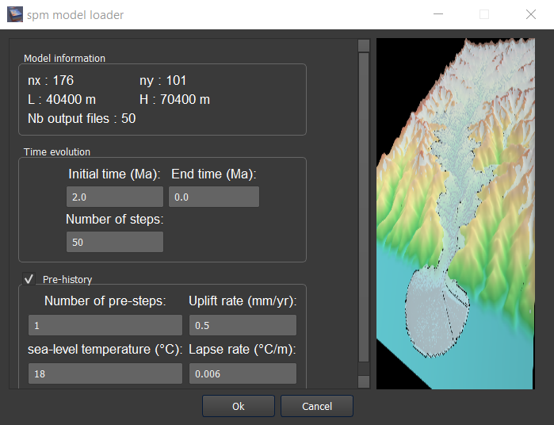

    *Figure 3. Spm loader window.*
     
     
| This window recovers some characteristics of your spm model, which are shown on the top for checking (works for iSOSIA models only). Then, you are asked to provide the starting and ending times of your model (in Ma), as well as the number of steps (i.e., the number of topographic files). The initial time is older than the end time. This is required to automatically set the time values for the “Time evolution” tab.

| You are also able to provide a simple pre-spm history for the topographic evolution. For that purpose, click on “Pre-history” (Figure 3). You will be able to provide 4 parameters:

    *	*number of pre-steps*: how many steps for the pre-spm history you want to provide topographic information
    *	*uplift rate*: this will be assumed to be spatially uniform and applied to all pre-history steps 
    *	*sea-level temperature*
    *	*atmospheric lapse rate*

| PecubeGUI will start from the first topographic file provided and interpolate back the pre-spm topographic history according to the amplitude and offset parameters you will provide in the next steps (see :ref:`Time-evolution-tab`).
| After clicking the “Ok” button, the files will be copied and pasted into “your_current_project_path\\data\\SPM”. In the meantime, the name “SPM/” is automatically provided to the input parameters “Topography file name”, as well as the grid resolution (i.e., nx and ny, works only with iSOSIA files, Figure 3).
  
| When loading a synthetic numerical model, you can let the latitude and longitude to zero. However, you need to provide the stepping distance in x (Δlon) and y (Δlat). For simplicity, you can provide the values in km and then click on ‘Convert to lat/long’ button (Figure 2). This will automatically convert the values to longitude and latitude distances that can be read by Pecube. 

| Alternatively, you can extract a DEM from OpenTopography. To do so, you will need first to request an API key from OpenTopography website (`request api key <https://opentopography.org/blog/introducing-api-keys-access-opentopography-global-datasets>`_ ). Then copy your key in a text file, name it "OpenTopoKey.txt", and put the file in the root directory of PecubeGUI application (i.e., the same location than the Pecube directory). To download a DEM of you region of interest (ROI), provide the coordinates and resolution of the topography in the "Topography" tab (i.e., nx, ny, longitude 0, latitude 0, Δlon, Δlat). Click on "Get topo..." button will then extract the DEM. This option use the python package bmi_topography [Piper-2021]_ to download the DEM from the SRTMGL3 (90 m resolution) hosted by OpenTopography. According to the size of you ROI it can take few second to download. Once the DEM is downloaded, it can be found in "your_current_project/data/" directory. Click on "load file(s)" (Figure 2) to load the DEM within the interface. 

.. important:: If you use the DEM from the SRTM data hosted by OpenTopography, please use this citation: NASA Shuttle Radar Topography Mission (SRTM) (2013). Shuttle Radar Topography Mission (SRTM) Global. Distributed by OpenTopography. https://doi.org/10.5069/G9445JDF. Accessed: 2022-11-18. With the in-text citation: NASA Shuttle Radar Topography Mission (2013).

| You can also decide to build a simple sinusoïdal topography. For this purpose, click on "Build topo..." (Figure 2). A window pops up in which you can set the dimension and resolution of the synthetic topography as well as the amplitude, wavelength, and a phase shift (Figure 5). When you are done, click on "Ok" and the topography will be automatically loaded within the interface.

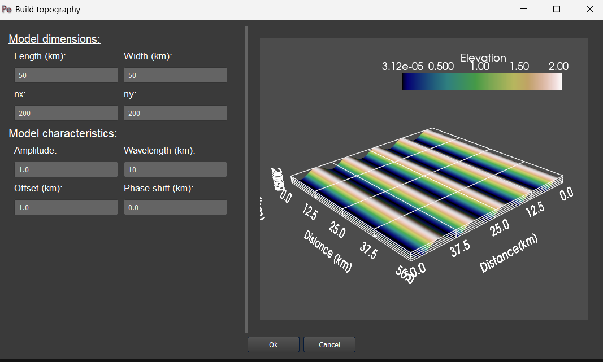

  *Figure 5. Window showing up when clicking on 'build topo..." (Figure 2) to build a synthetic sinusoïdal topography.*
  
| Finally, you can check your input topography by clicking on “Show topography” (Figure 2). A new tab appears on the right-hand side of the interface (Figure 6). This tab serves to visualize the topography and check your topography history as provided in the :ref:`Time-evolution-tab`. For this, simply grab and drag the slide bar in “Set time evolution” (Figure 6).

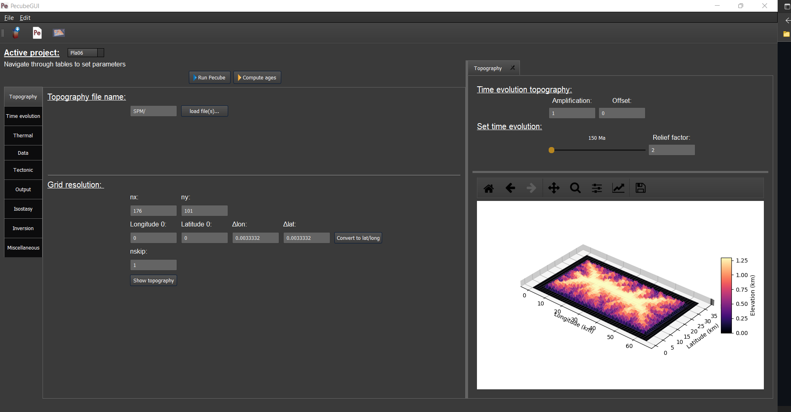

    *Figure 6. "Topography" tab with the topography shown on the right-hand side, after clicking the "Show topogaphy" button. Here, the topography is loaded from a DEM from the Rhone valley in Switzerland.*

.. _Time-evolution-tab:

Time evolution tab
--------------------

==================================

In this tab (Figure 7) you can provide all the parameters controlling the time evolution of the input topography. In PecubeGUI you can provide the time evolution parameters (cf. “time_topo”,” amplification”, “offset”, and “output”) by filling in the table or by copying/pasting values from an excel file to the table. The number of rows in the table automatically updates from the value written in the parameter “ntime” (Figure 7). 

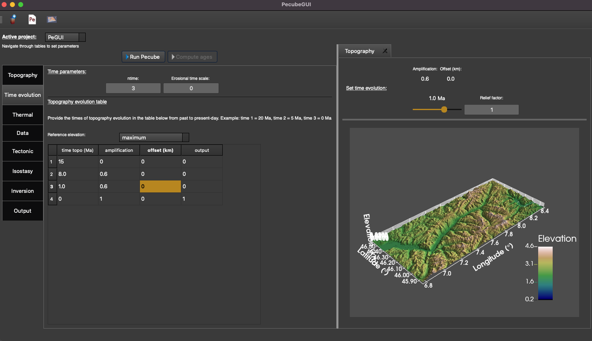

    *Figure 7. "Time evolution" tab where to provide the parameters related to the time evolution of the topography. In this example, the topography evolution is defined relative to the maximum elevation.*

| The default value for each parameter is also automatically provided. 
| In the previous versions of Pecube, one could provide a topography as input and set its evolution through time by varying the amplification and offset parameters, according to the following equation:
|

| h\ :sub:`i`\ = offset\ :sub:`i`\  +  amplification\ :sub:`i`\  *  h\ :sub:`0`\

|
| The formulation of the above equation has been modified in PecubeGUI to allow for choosing the reference elevation from which to apply the relief amplification factor. One can now choose to have the sea level, minimum, maximum, or mean elevation as a reference (see Figure 8). The topographic evolution now follows:

| h\ :sub:`i`\ = offset\ :sub:`i`\  +  topo_ref - [amplification\ :sub:`i`\  *  (topo_ref - h\ :sub:`0`\)]

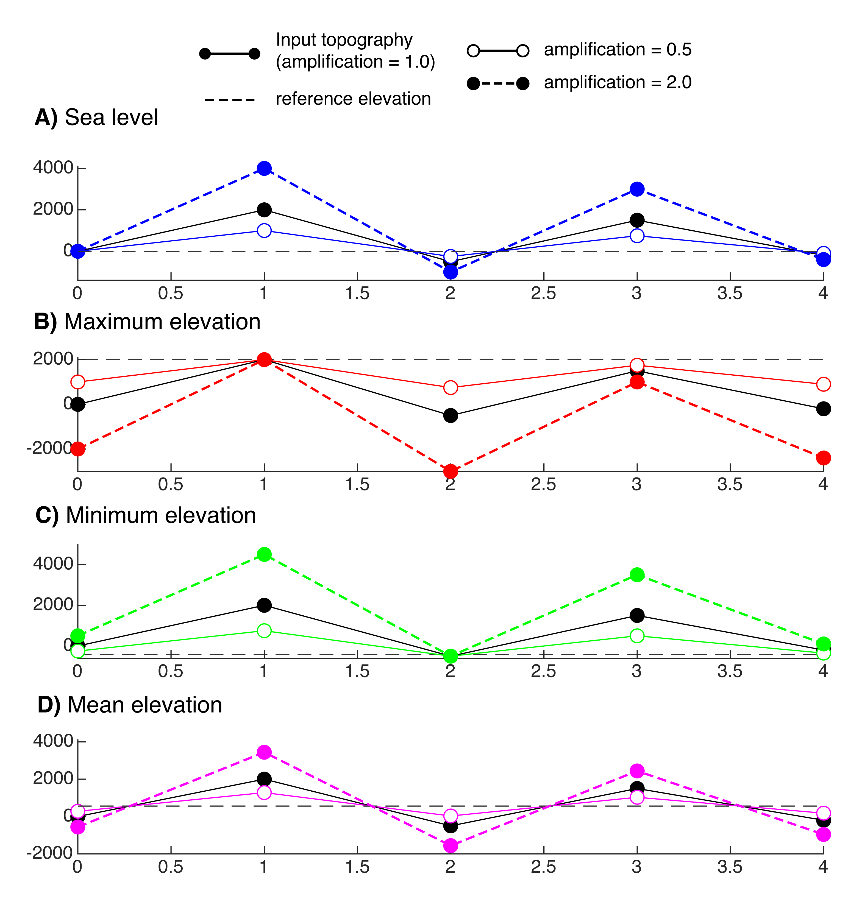

    *Figure 8. Reference elevations from which to apply the relief amplification factor. These references are A) sea level, B) minimum, C) maximum, D) mean elevation.*

.. _Thermal-tab:

Thermal tab
-------------------

==================================

| In the :ref:`Thermal-tab`, you will find all the parameters to set the thermal properties of the crust and the atmosphere of your model. In PecubeGUI, the user can check for the 1D steady-state geotherm by simply clicking on "Show Geotherm" (Figure 9). A new tab appears on the right-hand side of the interface, where the geotherm is shown. Additionnaly, the user can check the influence of the erosion rate on the geotherm by providing values in "Mean erosion rate" (Figure 9, only for visual purposes). The 1D steady-state geotherm is computed using the equation found in [Reiners-and-Brandon-2006]_ that accounts for the effect of erosion rates on the thermal state of the crust.
| Moreover, the user can provide the specific heat capacity (J.kg\ :sup:`-1`\.K\ :sup:`-1`\) and the radioactive heat production (µW.m\ :sup:`-3`\). The equivalent heat production rate (°C.Myr\ :sup:`-1`\) will automatically be updated (Figure 9). Finally, the resulting surface heat flux is shown as a checking. 
The user can also set a non-uniform heat production rate. An exponential decrease of heat production rate with depth can be specified by checking the box "use e-folding HP". A small window pops up where you can provide the heat production rate and the e-folding depth. In the input parameters for pecube, the heat production rate will then be negative to inform pecube you want to use a non-uniform heat production rate.

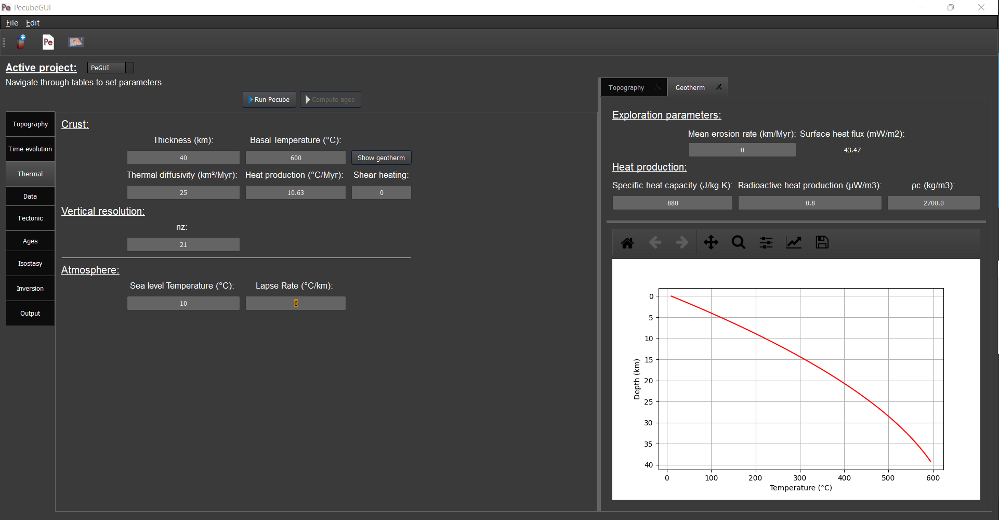
  
  *Figure 9. "Geotherm" tab where to provide parameters related to Thermal properties of the crust and the atmosphere.*

.. _Data-tab:

Data tab
-------------------

==================================

| The first part (i.e., “Compute ages”) let you choose between three options:

*	*none*: Pecube will not predict any thermochronological ages
*	*for all nodes*: Pecube will predict thermochronological ages for all nodes at the surface of the Pecube model. 
*	*sample specific*: Pecube will predict thermochronological ages only for specific sample locations provided by the user.

| If you choose 'sample specific', you can provide the location of sample(s) from where to extract the thermal paths to compute ages at these specific locations. You provide the name of the directory "Data folder name" where the required file with the locations and observations will be stored and fill in the table below (Figure 10) by providing the number of samples, and their respective coordinates (latitude and longitude), elevation, and the number of observation for each thermochronometers.
Warning: the ID of a sample must not include space !
Finally you can check for your sample location on the input topography by clicking on "Check sample locations", as well as the predicted elevation of the samples on the input DEM (potentially degraded wit 'nskip' parameters) by clicking on 'Check sample elevations'.

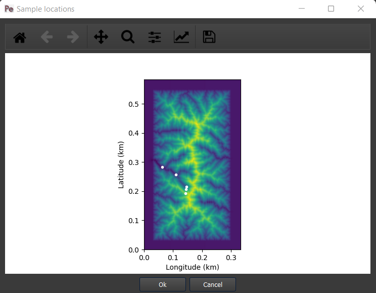
  
  *Figure 10. "Data" tab where to provide the sample location(s) and number of observations for each thermochronometers. The extra window shows the location of the samples, here in the Rhone valley area (data from Valla et al., 2012)*

After providing the number of observations, you can click on 'Show/update ages tab. A tab will open, where you can provide information for each thermochronometer (Figure 11). 

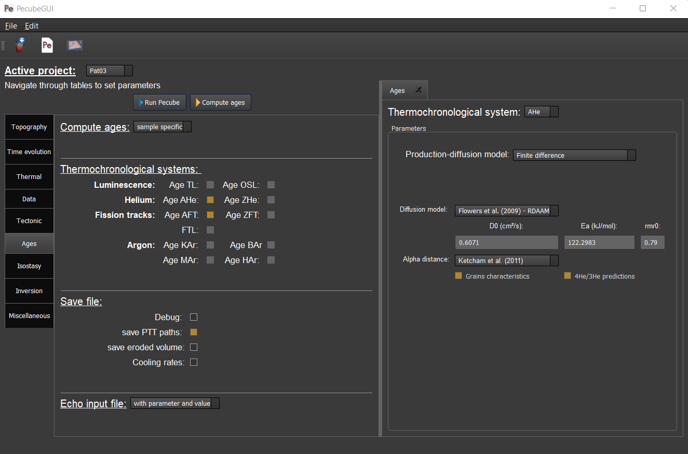
  
  *Figure 11. "Ages" tab where to define the thermochronometers to use. Here, the example is made with sample specific predictions for the apatite (U-Th)/He system.*
  

| Here you can provide observations (ages with errors), and shows extra parameters for the computation of grain-specific ages. These extra parameters include for e.g., (U-Th)/he based thermochronometer:

*	*Diffusion model*: the helium diffusion model to use. The options are the Farley et al. (2000), Shuster et al. (2006), and the radiation damage models from Gautheron et al. (2009), Flowers et al. (2009, RDAAM) and Willett et al. (2017, ADAM).
*	*Ea*: The activation energy (kJ.mol\ :sup:`-1`\). This is automatically updated according to the selected diffusion model, but it can be changed at the user’s discretion.
*	*D0*: the diffusivity parameter value for infinite temperature (cm\ :sup:`2`\.s\ :sup:`-1`\). The value updates according to the selected diffusion model. 
* *stopping distances*: stopping distances for alpha particules from Farley et al. (1999) or Ketcham et al. (2011). 
*	*Table of observations*: The table includes the observed ages and their uncertainties, the size (radius) of the grains, their uranium and thorium concentration (in ppm), and the rmr0 kinetic parameters (only for Flowers et al. (2009) and Gautheron et al. (2009) diffusion models). In the current version, the grain is assumed spherical. 
*	*4He/3He predictions*: allows to predict \ :sup:`4`\He/\ :sup:`3`\He profiles for each grain. When checked, a new window opens. Within this window, you can provide your heating schedule, with the number of steps, or let the default heating schedule. This will be used in the diffusion model to simulate a degassing experiment and compute \ :sup:`4`\He/\ :sup:`3`\He ratios. The heat is in °C and the duration in hours. The same heating schedule is used for each grain. 

Tectonic tab
-------------------

==================================

| This tab is related to the “Tectonic parameters” in the Pecube user guide. At the top of the tab you have to choose between three options:

* no uplift: compute the effect of topographic change only on thermal field 
* bloc uplift: vertically uniform movement of the entire domain
* faulting: slip rate along fault(s)

| According to the option chosen, you will have access to different part of the tab. For a bloc uplift, you can define the magnitude of the uplift rate at each corner of the model domain (i.e., bottom left, bottom right, top left, and top right). The uplift history is defined by the number of step (i.e., 'nstep') and the time window defined in the table below. 

| When faulting is chosen, the button' 'set faults' is enabled. Clicking on it open a window where you can define your fault(s) geometry. You need to provide the number of faults ('nfaults'), the number of points that will define the geometry of each fault ('npoints'), and the coordinates of the two points that define the orientation of the faults (see Pecube's documentation for more details). Then you can define each geometry by setting the position and depth of each points of the fault according to the coordinates of the fault plane. 

.. note::
  (1) To define the type of fault, we keep on the convention described in the Pecube's documentation. To define a thrust the velocity has to be negative, a positive velocity means a normal fault (i.e., 'velo' in the table).
  (2) The order you define the position of the points of the fault(s) matters. The convention is that the fault geometry is defined to the right of the strike of the fault (see Pecube's documentation for more details)

.. figure:: ../images/Tectonic_tab.png
  :scale: 30
  :align: center
  
  *Figure 12. "Tectonic" tab where to provide parameters related to kinematic of rock uplift.*

Inversion tab
--------------------

==================================

| In this tab, you will find parameters to (i) control the inversion procedure, or (ii) to use Pecube in Batch mode. The latter has been introduced with the development of the Pecube interface. Pecube Batch mode is useful to explore the effect of one parameter on e.g. resulting age-elevation profiles (so far this is the only option). In this mode, Pecube run a couple of models by changing the value of one parameter that the user specified as a range instead of a single value (i.e., using "min value: max value") within a single Pecube project. To use Pecube in Batch mode, select "batch" in the section "Choose inversion mode" and "Inversion mode:". Then, you can provide the number of intervals you wish to divide the range of the parameter values that you set. For instance, suppose a model designed as a bloc uplift with a single phase. One wish to investigate the effect of the exhumation rate in the resulting age-elevation profile. In this case, set the velocity (in Tectonic tab) to e.g., 0.2:2 km/Myr and then in inversion tab set the number of intervals to e.g., 4. Runing Pecube will launch 4 models whith uplift rate values of [0.2, 0.65, 1.10, 1.55, 2.0] km/Myr. Once the run is finished, go to the plotting area and load the Pecube project. Then, in the list of plots (see section "plot 2D data" below), you can plot "batch results" and choose the chart you wish to plot with the thermochronometer. Plotting for instance the age-elevation profiles will show all the predicted age-elevation relationships related to each uplift rate value (i.e., [0.2, 0.65, 1.10, 1.55, 2.0]) on a single plot.

Alternatively, one can choose to run Pecube in inversion mode. Pecube is coupled with the Neighborhood algorithm [Sambridge-et-al-1999]_ that manages the inversion procedure. One use Pecube in inversion mode to search for a range or a combination of parameter values that optimizes the fit to the data (i.e., or that minimizes the misfit). 

==================================

------------------
Run a Pecube model
------------------

| To run a Pecube model, simply click on “Run Pecube” above the tabs (Figure 12). A new window pops up. According to your preferences (cf. ‘2’, "Introduction" Figure 1) the latter will only show a progress bar of the Pecube run (‘Show console’ unchecked in Preferences) or additional information are provided if the console is enabled ("Show console” checked in Preferences).

| PecubeGUI first runs Pecube as usual, and if the option “sample specific” is set (cf, previous section), then PecubeGUI will run the external routine to predict specific ages. When the console is allowed to be shown, the state of the runs is written within it. At the end of the Pecube run, this window displays ‘Pecube run is finished!’ and you can click on the ‘Ok’ button to close the window.
| Note that you can also choose to not run Pecube but only the external routine to predict ages for sample-specific locations from an old Pecube project. This is useful when one wants to use e.g., another radiation damage model and do not want to run Pecube again. To do so, simply click on "Compute ages" (Figure 12).

.. note::
  When several projects are opened, the consoles are gathered in a single window to have a quick overview of all the running simulations.
  

----------------
Plotting results
----------------

In that section, I provide an overview of the chart part of PecubeGUI. There, you can plot results from your Pecube run. 

Plot 2D data
------------

==================================

To plot 2D data in PecubeGUI, first switch to the chart's window by clicking on ‘show ouput’ (see Figure 1 in "Introduction", n°5). You should see the window shown in Figure 13. On the left-hand side, you will find two tabs: *Data* and *Properties*. The first tab enables to load new data:

* *Load project...*: load a Pecube input file to plot data from that project.
* *Add 3D model...*: load a vtk file to render a 3D model.
* *Remove data...*: remove one or several plots. To do so, on the plot list on the left-hand side of the interface, select the plot you wish to remove and click 'Remove data...'.
* *Further data...*: a list of 2D data you can plot.

In the current version, and depending on your input parameters, Pecube can output several files. These files are:

*	*CompareAge.csv*: This file contains the predicted and observed ages as well as sample ID and coordinates.
*	*TimeTemperature.csv*: stores the thermal path of each sample location you provided, either by writing directly in a file in the ‘Data’ directory of your project, or by specifying the locations in PecubeGUI when want to predict specific AHe ages (see ‘Output parameters’ tab). For this file to be created, you also need to check ‘save PTT paths’ in the ‘Output parameters’ tab.
* *CoolingRates.csv*: contains the time-temperature paths from all nodes in the model. This file is created if the option "Cooling rates" is checked (see :ref:`Ages-tab`). This allow the user to plot a 2D map of cooling rates defining a temperature or time interval.
* *PecubeXXX.vtk*: This file is located in the "VTK" directory of your project. If loaded for 2D data plot, a window will show up and ask you which data to plot from the file. You can extract, for instance, the 2D spatial distribution of the temperature at a specified depth, or extract the depth of an isotherm.
* *AgeXXX.vtk*:  This file is located in the "VTK" directory of your project.  If loaded for 2D data plot, you can choose to plot the 2D spatial distribution of the erosion rate or the predicted ages, at the surface of the Pecube model (only with the "for all nodes" option, see :ref:`Ages-tab`).  

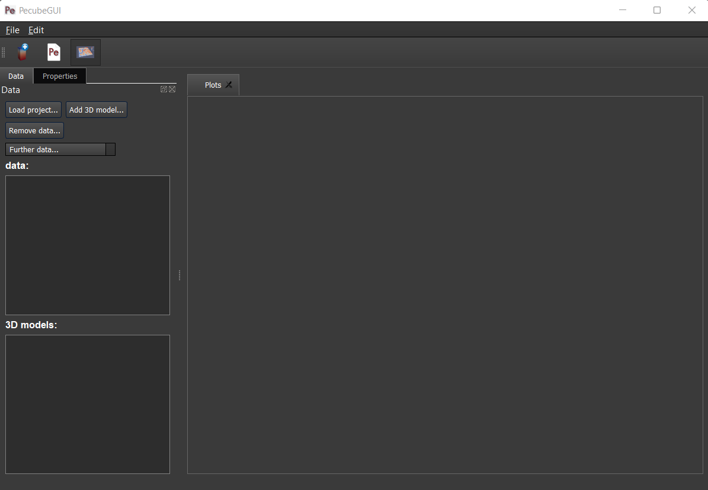
  
  *Figure 13. Chart's window.*
  
For each Pecube project, the 2D data you can plot will be listed in "Further data..." (Figure 13). However, you first need to tell PecubeGUI which pecube project you want to work with. To do so, click on ‘Load project…’, then a window appears and ask you to choose an input file corresponding to the Pecube project you desire to plot from. After loading the input file, the list below will update and show you what kind of data you can plot. From there you could plot:

* *Age-elevation*: the ages plotted against elevation. If you computed ages for all surface nodes of the model, then you will be asked to choose at which time step(s) you want to plot data. If you computed ages at specific locations and for several thermochronometers, all of them will be plotted along with observed data you provided. Then you will be free to show/hide data as you wish (see Figure 14).
* *Date-eU*: plot ages against effective uranium. Works only if you computed AHe ages at specific locations. 
* *Age-comparison*: plot observed vs predicted ages.
* *Age transect*: plot observed and predicted ages along transect (Latitude, longitude, or projected).
* *Tt paths*: plot the thermal path of each samples. Works only if you computed ages at specific locations. 
* *4He/3He data*: plot either 4He/3He spectra or step ages profiles. 
* *2D map of cooling rates*: compute cooling rates for all surface node of the model. You will be asked to define the temperature or time range on which you wish to calculate the cooling rates, as well as the interpolation method you want to use.
* *2D map of temperatures*: plot the temperature/depth map at a certain depth/isotherm. To plot this map you will need to load one of the "PecubeXXX.vtk" file in the "VTK" directory of you pecube project. 
* *2D map of Ages*: plot the ages at the surface of the model. Works only if you computed ages for all surface nodes! To plot this map you will need to load one of the "AgesXXX.vtk" file in the "VTK" directory of you pecube project. 
* *Inversion results*: plot the result of inversion. Three plot options are possible: 1) 2D parameter space, plot parameter X vs parameter Y in scatter plot where colors represent the misfit value. This option is enabled when running the sampling stage of the Neighborhood Algorithm (included in Pecube). The two other options 2) 2D parameter space + 1D PDF, and 3) 1 PDF single parameter, can only be used if the second stage (i.e., the appraisal stage) of the Neighborhood Algorithm has been run and the file "nab.out" is in the "NA" directory of your Pecube project.

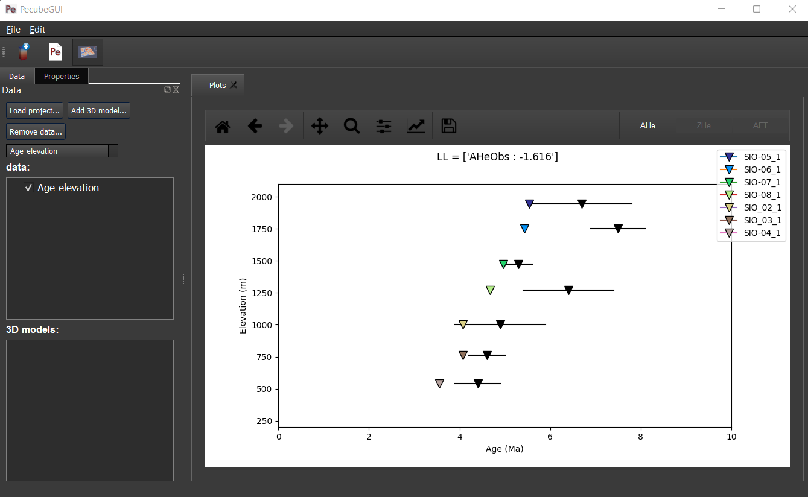
  
  *Figure 14. An example of an age-elevation plot. Here, AHe and AFT ages are predicted and compared against observations from the Rhone valley area.*

.. note::
  When plotting predictions from specific locations, and if observed data are provided, a misfit criteria between predicted and observed data is shown on the plot.
  This misfit criteria is known as the likelihood (in fact log-likelihood) that is the probability to have the observed data according to the model predictions.
  The log-likelyhood is defined following Braun et al. (2012):
  :math:`LL = -\sum_{j=1}^{N}(\frac{ln(2\pi)}{2}+ln(\sigma_j)+0.5(\frac{S^{obs}_j - S^{pred}_j}{ \sigma_j})^2`.
  
  Where :math:`S^{obs}_j` the observed data j and :math:`S^{pred}_j` the predicted data j, :math:`\sigma_j` the error
  on the observed data j, and N the total number of observed data. The higher the value of LL, the better is the match between observed and predicted data. 
  

Visualize 3D data
-----------------

==================================

| PecubeGUI offers a 3D interactive interface where to visualize 3D models alongside with sample locations (if defined). The 3D interface is handling with pyvista [Sullivan-et-al-2019]_, which is an open-source package to read and manage vtk files. 
| To load a 3D model, click on “Add 3D model…” and select your vtk file from your Pecube project directory. A new tab will appear with a 3D environment and the 3D model (Figure 15).
| If you chose to predict ages at specific locations, those locations will be automatically loaded with your 3D model. However, you can show/hide them by checking the box “show sample location(s)” on the properties tab (left side of the window, see Figure 15). On this tab, you have several options to set properties of the 3D model:

*	*Data range*: set the range of data for the colorbar.
*	*Current data*: list to choose the data to show (i.e., for the colormap).
* *X, Y, Z scales*: to scale the 3D model in the x, y, and z, directions.
* *Reset camera position*: reset the camera view to the initial position.
* *Clear plot*: remove the 3D model from the 3D interface.
* *Export image…*: save a screenshot of the 3D interface.
*	*Show box*: to show the axes of the 3D model.
*	*Show sample location(s)*: to show/hide sample locations within the 3D interface.

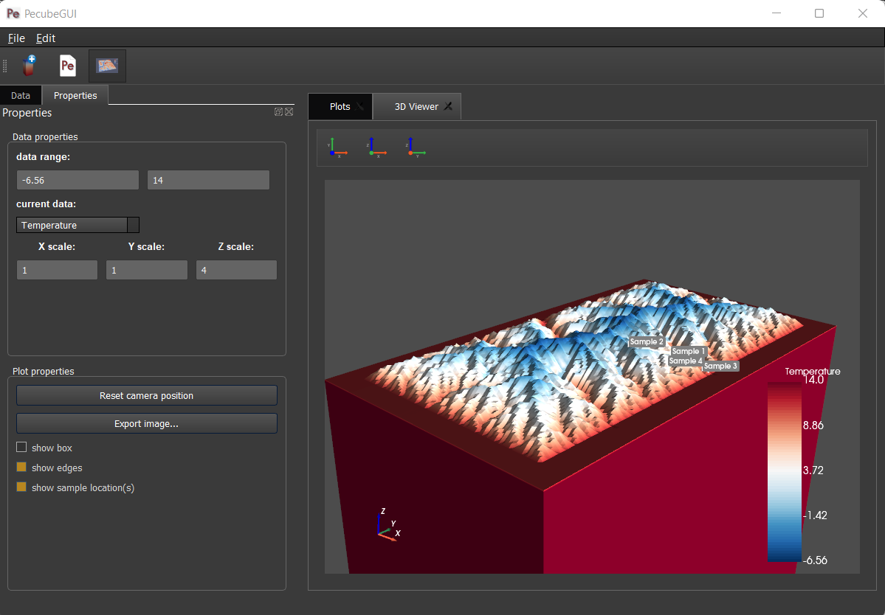
  
  *Figure 15. 3D viewer in PecubeGUI. An example is shown where the surface temperature is shown on the topography alongside with the sample locations that have been defined (see output tab).*

----------
References
----------

.. [Egholm_et-al-2011] Egholm, D. L., Knudsen, M. F., Clark, C. D., & Lesemann, J. E. (2011). Modeling the flow of glaciers in steep terrains: The integrated second‐order shallow ice approximation (iSOSIA). Journal of Geophysical Research: Earth Surface, 116(F2).
.. [Reiners-and-Brandon-2006] Reiners, P. W., & Brandon, M. T. (2006). Using thermochronology to understand orogenic erosion. Annu. Rev. Earth Planet. Sci., 34, 419-466.
.. [Gautheron-et-al-2010] Gautheron, C., & Tassan-Got, L. (2010). A Monte Carlo approach to diffusion applied to noble gas/helium thermochronology. Chemical Geology, 273(3-4), 212-224.
.. [Ketcham-2005] Ketcham, R. A. (2005). Forward and inverse modeling of low-temperature thermochronometry data. Reviews in mineralogy and geochemistry, 58(1), 275-314.
.. [Sambridge-et-al-1999] Sambridge, M. (1999). Geophysical inversion with a neighbourhood algorithm—I. Searching a parameter space. Geophysical journal international, 138(2), 479-494.
.. [Sullivan-et-al-2019] Sullivan et al., (2019). PyVista: 3D plotting and mesh analysis through a streamlined interface for the Visualization Toolkit (VTK). Journal of Open Source Software, 4(37), 1450, https://doi.org/10.21105/joss.01450
.. [Piper-2021] Piper, M. (2021). CSDMS Topography data component (Version 0.3.1) [Computer software]. https://doi.org/10.5281/zenodo.4608653
