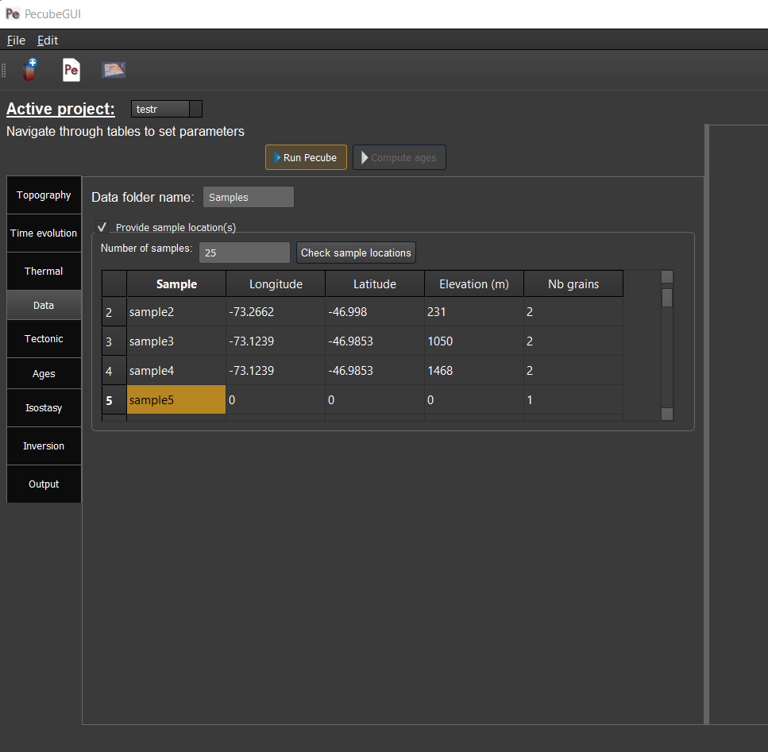
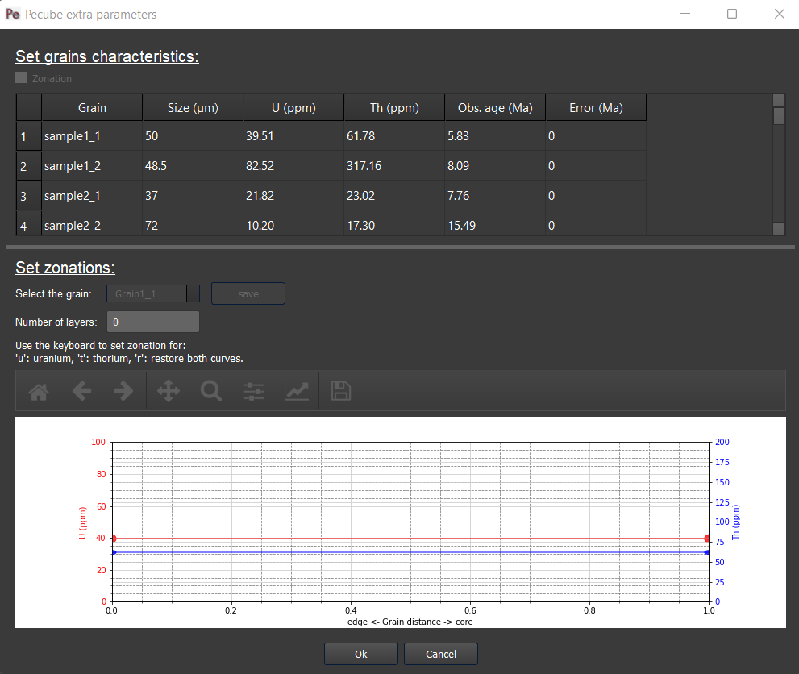

==============
Extended usage
==============

.. _runPecube:

---------------------------
Create a new Pecube project
---------------------------

To create and run a new Pecube project, go to *New input file* or press *Crtl+N* (*3*, see :doc:`introduction`),
a window pops up and asks you to provide the name of the new project (Figure *2*). After clicking the “Ok” button (Figure *2*),
you will be able to provide and set all the Pecube input parameters for your project.
  
.. figure:: ../images/New_Project.png
  :scale: 60
  :align: center

  *Figure 2. Enter a new project name. This window shows up when clicking on the "New input file" action.*

The window should look like the Figure *3*. On the top left, you could find and access all the projects you have loaded into the interface,
and thus navigate through their respective parameters. The right part of the interface will host extra input parameters described in the next sections.

.. figure:: ../images/Input_Parameters_interface.png
  :align: center

  *Figure 3. Tab to set up the input parameters for Pecube. On the top left, you can check the name of your project (here: ‘PeGUI’)*
  
  
The input parameters are gathered into categories as referenced in the Pecube’s user guide. All the parameters are sorted in *9* categories: *Topography*, *Time evolution*, *Thermal*, *Data*, *Tectonic*, *Output*, *Isostasy*, *Inversion*, and *Miscellaneous* parameters. For more details on the meaning of each input parameter please refer to the Pecube’s user guide. However, you could access to a short description of each parameter by simply flying the mouse cursor over the parameter labels. After one second a text should appears describing the parameter.
  
In the following, I provide a description of all the tabs, and how to provide the input parameters in PecubeGUI. For a detailed description of the parameters, please refer to the Pecube's user guide.

--------------------------
Providing input parameters
--------------------------

Topography tab
--------------

==================================

| I present in this section all kind of widgets you could find in PecubeGUI. When providing the project name, you will automatically be directed to the first tab that presents the "Topography" parameters (Figure 3). All the default values of the input parameters are shown, so that you do not need to provide them if you want to keep these default values. If you wish to change a parameter, simply click on the text box, and write your value. 
| PecubeGUI offers the possibility to simply load topographic file(s) from (1) a csv file containing one column of elevation, or (2) a serie of output files from a spm to be read by Pecube (see Pecube user guide – “Topography parameters”). For that purpose, click on ‘load file(s)’ (Figure 3) will allow you to select the files to load. A window pops up. The figure 4 shows an example where files from iSOSIA [Egholm_et-al-2011]_ have been loaded.

.. figure:: ../images/spm_loader.png
    :height: 268
    :width: 350
    :align: center

    *Figure 4. Spm loader window.*
     
     
| This window recovers some characteristics of your spm model, which are shown on the top for checking (works for iSOSIA models only). Then, you are asked to provide the starting and ending times of your model (in Ma), as well as the number of steps (i.e., the number of topographic files). The initial time is older than the end time. This is required as it will be used to automatically set the time values for the “Time evolution” tab.

| You are also able to provide a simple pre-spm history for the topographic evolution. For that purpose, click on “Pre-history” (Figure 4). You will be able to provide 4 parameters:

    *	*number of pre-steps*: how many steps for the pre-spm history you want to provide topographic information
    *	*uplift rate*: this will be assumed to be spatially uniform and applied to all pre-history steps 
    *	*sea-level temperature*
    *	*atmospheric lapse rate*

| PecubeGUI will start from the first topographic file provided and interpolate back the pre-spm topographic history according to the amplitude and offset parameters the user will provide in the next steps (see :ref:`Time-evolution-tab`).
| After clicking the “Ok” button, the files will be copied and pasted into “your_current_project_path\\data\\SPM”. In the meantime, the name “SPM/” is automatically provided to the input parameters “Topography file name”, as well as the grid resolution (i.e., nx and ny, works only with iSOSIA files, Figure 3).

.. figure:: ../images/setTopography.png
    :scale: 30
    :align: center

    *Figure 5. "Topography" tab with the topography shown on the left-hand side, after clicking the "Show topogaphy" button.*

| When loading a synthetic numerical model, you can let the latitude and longitude to zero. However, you need to provide the stepping distance in x (Δlon) and y (Δlat). For simplicity, you can provide the values in km and then click on ‘Convert to lat/long’ button (Figure 3). This will automatically convert the values to longitude and latitude distances that can be read by Pecube. Finally, you can check the topography you provided by clicking on “Show topography” (Figure 3). A new tab then appears on the right-hand side of the interface (Figure 5). This tab serves to visualize the topography and check your topography history as provided in the :ref:`Time-evolution-tab`. You are indeed able to visualize the evolution of the topography by grabbing and sliding the slide bar in “Set time evolution” (Figure 5).

.. _Time-evolution-tab:

Time evolution tab
--------------------

==================================

In this tab (Figure 6) you can provide all the parameters that control the time evolution of the Pecube model (see Pecube user guide for more details). The particularity in PecubeGUI is that you can provide the time evolution parameters (cf. “time_topo”,” amplification”, “offset”, and “output”) by filling in the table or by copying/pasting values from an excel file to the table. The number of rows in the table automatically adapts to the value written in the parameter “ntime” (Figure 6). 

.. figure:: ../images/Time_Evolution.png
    :scale: 30
    :align: center

    *Figure 6. "Time evolution" tab where to provide parameters related to the time evolution of the topography.*

| The default value for each parameter is also automatically provided. 
| In the previous versions of Pecube, one could provide a topography as input and its evolution through time by varying the amplification and offset parameters. The topographic evolution function was as follow:
| h:inf:`i` = offset:inf:`i` + topo_ref - (amplification:inf:`i` * (topo_ref - h:inf:`o`)

.. _Thermal-tab:

Thermal tab
-------------------

==================================

| In the :ref:`Thermal-tab`, you will find all the parameters to set the thermal properties of the crust and the atmosphere. In PecubeGUI, the user can check for the 1D steady-state geotherm by simply clicking on "Show Geotherm" (Figure 7). A new tab will appears on the left-hand side of the interface, where the geotherm is shown. Additionnaly, the user can check the influence of the erosion rate on the geotherm by providing values in "Mean erosion rate" (Figure 7). The 1D steady-state geotherm is computed using the equation find in [Reiners-and-Brandon-2006]_ that accounts for the effect of erosion rates on the thermal state of the crust.
| Moreover, the user can provide the specific heat capacity (J.kg\ :sup:`-1`\.K\ :sup:`-1`\) and the radioactive heat production (µW.m\ :sup:`-3`\). The total heat production (°C.Myr\ :sup:`-1`\) will automatically be updated (Figure 7).

.. figure:: ../images/Geotherm.png
  :scale: 30
  :align: center
  
  *Figure 7. "Geotherm" tab where to provide parameters related to Thermal properties of the crust and the atmosphere.*

.. _Data-tab:

Data tab
-------------------

==================================

| In this tab you can provide the location of sample(s) where to extract the thermal paths, and compute ages at these specific locations when using the "sample specific" option in :ref:`Ages-tab`. You provide the name of the directory "Data folder" where the required file with the locations will be stored and fill in the table below (Figure 8) by providing at minima the number of samples, the latitude and longitude of the sample locations. You can provide the observed elevation and define the number of grain you want to predict for each sample. These information will be used in the :ref:`Ages-tab` to define the grain characteristics for the age computation of each thermochronometers. Finally you can check for your sample location on the input topography by clicking on "Check sample locations".

  
  *Figure 8. "Data" tab where to provide the sample location(s) where to predict specific ages.*

Tectonic tab
-------------------

==================================

| This tab is related to the “Tectonic parameters” in the Pecube user guide. At the top of the tab you have to choose between three options:

* no uplift: compute the effect of topographic change only on thermal field 
* bloc uplift: vertical movement of the entire domain
* faulting: vertical movement along fault(s)

| According to the option chosen, you will have access to different part of the tab. For a bloc uplift, you can define the magnitude of the uplift rate at each corner of the model domain (i.e., bottom left, bottom right, top left, and top right). The uplift history is defined by the number of step (i.e., 'nstep') and the time window defined in the table below. 

| When faulting is chosen, the button' 'set faults' is enabled. Clicking on it open a window where you can define your fault(s) geometry. You need to provide the number of faults ('nfaults'), the number of points defining each fault ('npoints'), and the coordinates of the two points that define the strike of the faults (see Pecube's documentation for more details). Then you can define the geometry of the fault(s) by setting the position and depth of each points of the fault according to the position of strike of the fault. 

.. note::
  (1) To define the type of fault, we keep on the convention described in the Pecube's documentation. To define a thrust the velocity has to be negative, a positive velocity means a normal fault (i.e., 'velo' in the table).
  (2) The order you define the position of the points of the fault(s) matters. The convention is that the fault geometry is defined to the right of the strike of the fault (see Pecube's documentation for more details)

.. figure:: ../images/Tectonic_tab.png
  :scale: 30
  :align: center
  
  *Figure 9. "Tectonic" tab where to provide parameters related to kinematic of rock uplift.*

.. _Ages-tab:

Ages tab
-------------------

==================================

This tab enables the user to set the outputs he/she wants that Pecube provides at the end of the model run (Figure 10). The first part (i.e., “Compute ages”) let you choose between three options:

*	*none*: Pecube will not predict any thermochronological ages
*	*for all nodes*: Pecube will predict thermochronological ages for all nodes at the surface of the Pecube model. This option will enable you to check any boxes in the next part (i.e., “Thermochronological systems”) and to choose the thermochronological system you are interested to use. 
*	*sample specific*: Pecube will predict thermochronological ages only for specific sample locations provided by the user. For this option to work, you will need to provide a folder name where PecubeGUI will write some files that will be used by the production-diffusion model. This has to be done in the *Data tab* in the “Data folder” text box. In the current version, only the AHe and AFT systems can be selected. PecubeGUI uses either the production-diffusion model developped by [Gautheron-et-al-2010]_ or a simpler finite-difference model (see below).

.. figure:: ../images/Ages_Tab.png
  :scale: 30
  :align: center
  
  *Figure 10. "Ages" tab where to define the thermochronometers to use. Here, the example is made with sample specific predictions for the apatite (U-Th)/He system.*
  
| If you chose the “sample specific” option, then when clicking on “Age AHe” check box a new window will pop up (Figure 10). 
| This window shows extra parameters for the computation of AHe ages. These extra parameters include:

*	*Diffusion model*: the helium diffusion model to use. The options are the Farley et al. (2000), Shuster et al. (2006), and the radiation damage models from Gautheron et al. (2009), Flowers et al. (2009, RDAAM) and Willett et al. (2017, ADAM).
*	*Ea*: The activation energy (kJ.mol\ :sup:`-1`\). This is automatically updated according to the selected diffusion model, but it can be changed at the user’s discretion.
*	*rmr0*: “The reduced length of the more-resistant apatite at the time-temperature conditions where the reduced length of the less-resistant apatite falls to zero” [Ketcham-2005]_. This parameter is used in the annealing computation of radiation damages. The default value is 0.79.
*	*D0*: the diffusivity parameter value for infinite temperature (cm\ :sup:`2`\.s\ :sup:`-1`\). The value updates according to the selected diffusion model. 
*	*Number of iterations*: number of events (i.e. atoms) for the Monte carlo simulation [Gautheron-et-al-2010]_.
* *Alpha stopping distances*: stopping distances for alpha particules from Farley et al. (1999) or Ketcham et al. (2011). Only avalaible for the finite difference production-diffusion model.
*	*Grains characteristics*: when checking this box, a new window opens (Figure 11). It shows a table in which you can change the size (radius) of the grains, as well as their uranium and thorium concentration (in ppm). Default values are assigned automatically. In the current version, the grain is assumed spherical. You can also provide observed ages and associated error in the two last columns of the table. These data will be drawn in the output charts to compare with the predicted data. The user can also provide zonation profile for each grain. For this purpose, simply check the box "Zonation" (Figure 11), and then you will be able to draw the zonation profile by adding and dragging points on the both curves representing uranium and thorium profiles. As the respective concentrations are averaged within layers in the grain, you need to provide the number you desire ("Number of layers", Figure 11). When finished to set the profile for the grain, click on "Save" to save the profile for that grain.
*	*4He/3He predictions*: allows to predict \ :sup:`4`\He/\ :sup:`3`\He profiles for each grain. When checked, a new window opens. Within this window, you can provide your heating schedule, with the number of steps, or let the default heating schedule. This will be used in the diffusion model to simulate a degassing experiment and compute \ :sup:`4`\He/\ :sup:`3`\He ratios. The heat is in °C and the duration in hours. The same heating schedule is used for each grain. 

  
  *Figure 11. Window that appears when checking the box "Grain characteristics" (Figure 10).*
  

.. figure:: ../images/Sample_location.png
  :scale: 50
  :align: center
  
  *Figure 12. Window that appears when clicking on "Check sample location". The surface topography of your model is shown with the location of your samples (white circles).*

The remaining tabs do not need detailed description. Simply fill the text boxes with your new values. The details for each input parameters can be found in the Pecube user guide, and short descriptions can be seen when flying the mouse cursor over the label of each parameter.

------------------
Run a Pecube model
------------------

| To run a Pecube model, simply click on “Run Pecube” above the tabs (Figure 10). A new window pops up. According to your preferences (cf. ‘2’, Figure 1) the latter will only show a progress bar of the Pecube run (‘Show console’ unchecked in Preferences) or additional information are provided if the console is enabled ("Show console” checked in Preferences).

| PecubeGUI first runs Pecube as usual, and if the option “sample specific” is set (cf, previous section), then PecubeGUI will run the external routine to predict specific ages. When the console is allowed to be shown, the state of the runs is written within it. At the end of the Pecube run, this window displays ‘Pecube run is finished!’ and you can click on the ‘Ok’ button to close the window.
| Note that you can also choose to not run Pecube but only the external routine to predict ages for sample-specific locations from an old Pecube project. This is useful when one wants to use e.g., another radiation damage model and do not want to run Pecube again. To do so, simply click on "Compute ages" (Figure 10).

.. note::
  When several projects are opened, the consoles are gathered in a single window to have a quick overview of all the running simulations.
  

----------------
Plotting results
----------------

In that section, I provide an overview of the chart part of PecubeGUI. There, you can plot results from your Pecube run. 

Plot 2D data
------------

==================================

In the current version, and depending on your input parameters, Pecube can output several files that you can then load into PecubeGUI to plot some results. These files are:

*	*TimeTemperature.csv*: stores the thermal path of each sample location you provided, either by writing directly in a file in the ‘Data’ directory of your project, or by specifying the locations in PecubeGUI when want to predict specific AHe ages (see ‘Output parameters’ tab). For this file to be created, you also need to check ‘save PTT paths’ in the ‘Output parameters’ tab.
*	*Graini_j*: stores the input parameters used for the production-diffusion model from Gautheron et al. (2010), and the resulting ages computed according to the thermal history provided. You will find in this file: the thermal history of the sample, its age evolution, and the degassing fractions of \ :sup:`4`\He and \ :sup:`3`\He (if defined by the user, see :ref:`Ages-tab`). If the simpler production-diffusion (finite difference) model is used then the ages and 4He/3He data are found in files "TimeAge.csv" and "43He.csv" respectively.
* *CoolingRates.csv*: contains the time-temperature paths from all nodes in the model. This file is created if the option "Cooling rates" is checked (see :ref:`Ages-tab`). This allow the user to plot a 2D map of cooling rates defining a temperature or time interval.
* *PecubeXXX.vtk*: This file is located in the "VTK" directory of your project. If loaded for 2D data plot, a window will show up and ask you which data to plot from the file. You can extract, for instance, the 2D spatial distribution of the temperature at a specified depth, or extract the depth of an isotherm.
* *AgeXXX.vtk*:  This file is located in the "VTK" directory of your project.  If loaded for 2D data plot, you can choose to plot the 2D spatial distribution of the erosion rate or the predicted ages, at the surface of the Pecube model (only with the "for all nodes" option, see :ref:`Ages-tab`).

To be able to plot 2D data in PecubeGUI, first switch to the chart's window by clicking on ‘show ouput’ (see Figure 1, n°5). You should see the window shown in Figure 13. On the left-hand side, you will find two tabs: *Data* and *Properties*. The first tab enables to load new data.  

.. figure:: ../images/Chart_window.png
  :scale: 30
  :align: center
  
  *Figure 13. Chart's window.*
  
For each Pecube project, the 2D data you can plot will be listed in "Further data..." (Figure 13). However, you first need to tell PecubeGUI which pecube project you want to work with. To do so, click on ‘Add 2D data…’, then a window appears and ask you to choose a csv file to search for some data to plot. You can load any of the files mentioned above, and then click "Cancel". The list below will update and show you what kind of data you can plot. From there you could plot:

* *Age-elevation profiles*: the ages plotted against elevation. If you computed ages for all surface nodes of the model, then you will be asked to choose at which time step(s) you want to plot data. If you computed ages at specific locations and for several thermochronometers, you will be asked to choose which of them you want to plot (can be all).
* *date vs eU plots*: plot ages against effective uranium. Works only if you computed AHe ages at specific locations. 
* *Age-distance*: plot ages against latitude of the model. Works only if you computed ages at specific locations. 
* *Tt paths*: plot the thermal path of each samples. Works only if you computed ages at specific locations. 
* *4He/3He data*: plot either 4He/3He spectra or step ages profiles. Select the range of data you wish to plot from the table that pop up. 
* *2D map of cooling rates*: compute cooling rates for all surface node of the model. You will be asked to define the temperature or time range on which you wish to calculate the cooling rates, as well as the interpolation method you want to use.
* *2D map of temperatures*: plot the temperature/depth map at a certain depth/isotherm. To plot this map you will need to load one of the "PecubeXXX.vtk" file in the "VTK" directory of you pecube project. 
* *2D map of Ages*: plot the ages at the surface of the model. Works only if you computed ages for all surface nodes! To plot this map you will need to load one of the "AgesXXX.vtk" file in the "VTK" directory of you pecube project. 

Visualize 3D data
-----------------

==================================

| PecubeGUI offers a 3D interactive interface where to visualize 3D models alongside with sample locations (if defined). The 3D interface is handling with pyvista [Sullivan-et-al-2019]_, which is an open-source package to read and manage vtk files. 
| To load a 3D model, click on “Add 3D model…” and select your vtk file from your Pecube project directory. A new tab will appear with a 3D environment and the 3D model (Figure 14).
| If you chose to predict ages at specific locations, those locations will be automatically loaded with your 3D model. However, you can show/hide them by checking the box “show sample location(s)” on the properties tab (left side of the window, see Figure 14). On this tab, you have several options to set properties of the 3D model:

*	*Data range*: set the range of data for the colorbar.
*	*Current data*: list to choose the data to show (i.e., for the colormap).
* *X, Y, Z scales*: to scale the 3D model in the x, y, and z, directions.
* *Reset camera position*: reset the camera view to the initial position.
* *Clear plot*: remove the 3D model from the 3D interface.
* *Export image…*: save a screenshot of the 3D interface.
*	*Show box*: to show the axes of the 3D model.
*	*Show sample location(s)*: to show/hide sample locations within the 3D interface.

.. figure:: ../images/3D_render.png
  :scale: 30
  :align: center
  
  *Figure 14. 3D viewer in PecubeGUI. An example is shown where the surface temperature is shown on the topography alongside with the sample locations that have been defined (see output tab).*

----------
References
----------

.. [Egholm_et-al-2011] Egholm, D. L., Knudsen, M. F., Clark, C. D., & Lesemann, J. E. (2011). Modeling the flow of glaciers in steep terrains: The integrated second‐order shallow ice approximation (iSOSIA). Journal of Geophysical Research: Earth Surface, 116(F2).
.. [Reiners-and-Brandon-2006] Reiners, P. W., & Brandon, M. T. (2006). Using thermochronology to understand orogenic erosion. Annu. Rev. Earth Planet. Sci., 34, 419-466.
.. [Gautheron-et-al-2010] Gautheron, C., & Tassan-Got, L. (2010). A Monte Carlo approach to diffusion applied to noble gas/helium thermochronology. Chemical Geology, 273(3-4), 212-224.
.. [Ketcham-2005] Ketcham, R. A. (2005). Forward and inverse modeling of low-temperature thermochronometry data. Reviews in mineralogy and geochemistry, 58(1), 275-314.
.. [Sullivan-et-al-2019] Sullivan et al., (2019). PyVista: 3D plotting and mesh analysis through a streamlined interface for the Visualization Toolkit (VTK). Journal of Open Source Software, 4(37), 1450, https://doi.org/10.21105/joss.01450
