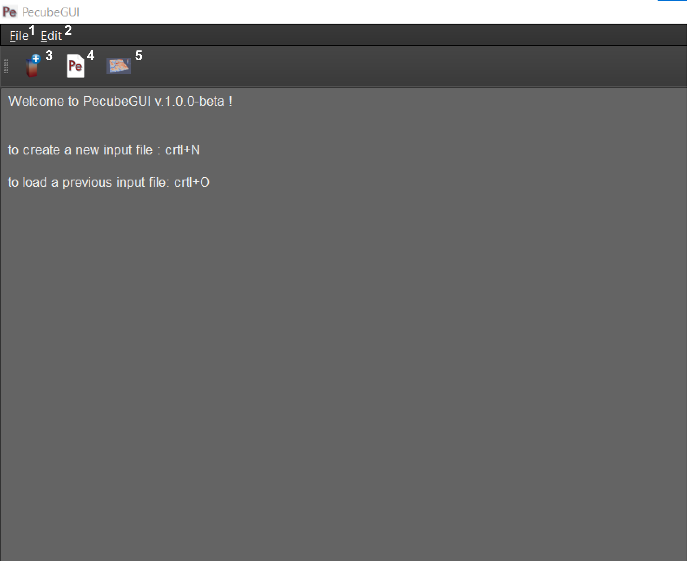

============
Introduction
============

.. _introduction:

Let's start here with a quick introduction of the interface.

When opening PecubeGUI, a window will show up with a welcome message (Figure 1). This is the main window where you can access all the functionalities. Here, I give a brief overview of the access.

    
    *Figure 1. Main interface of PecubeGUI.*

The numbers on Figure 1 give access to the followings:

1. **File menu**. This menu comprises three options:

  - *New Input file*: open a new Pecube project from which to set new input parameters.
  - *Open…*: open an old input file and load the input parameters
  - *Exit*: quit PecubeGUI. 
  All these actions can be called with keyboard shortcuts, found next to the action labels.

2. **Edit menu**. Here you can access some preferences for the GUI:

  - *Preferences*:
      +	GUI theme: ‘Dark’ or ‘White’. Default is ‘Dark’.
      + Show Console: allows to show a console when running Pecube, that shows some Pecube running outputs.
      
3. **New input file**. Open a new Pecube project.

4. **Open Pecube file**. Open an old Pecube input file.

5. **show output**. Switch to the graphic area, to plot 2D or 3D data.

