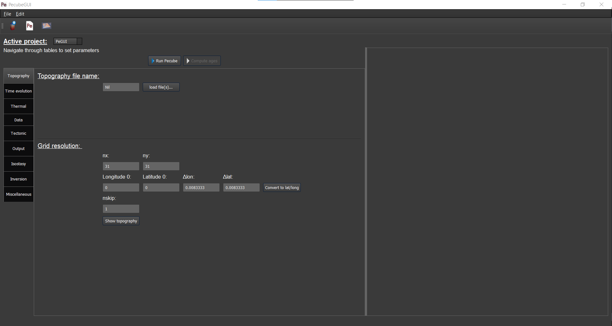
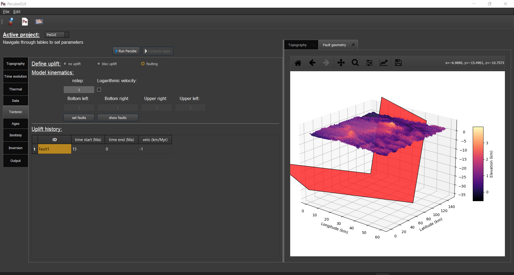
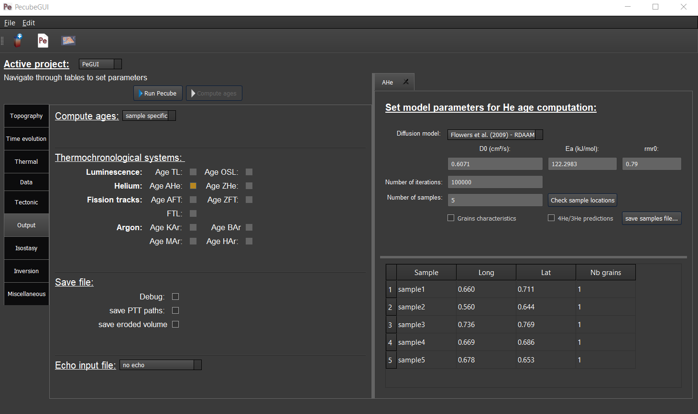

=========
RunPecube
=========

.. _runPecube:

---------------------------
Create a new Pecube project
---------------------------

To create and run a new Pecube project, go to *New input file* or press *Crtl+N* (*3*, see introduction),
a widow pops up and ask you to provide the name of the new project (Figure *2*). After clicking the “Ok” button (Figure *2*),
you will be able to provide and set all the Pecube input parameters for your project.
  
.. figure:: ../images/New_Project.png

  *Figure 2. Enter a new project name. This window shows up when clicking on the "New input file" action.*

The window should look like the Figure *3*. On the top left, you could find and access all the projects you have loaded into the interface,
and thus navigate through their respective parameters. The right part of the interface will host extra input parameters described in the next sections.

  *Figure 3. Tab to set up the input parameters for Pecube. On the top left, you can check the name of your project (here: ‘PeGUI’)*
  
  
  The input parameters are presented by categories as referenced in the Pecube’s user guide. All the parameters are sorted in *9* categories: *Topography*, *Time evolution*, *Thermal*, *Data*, *Tectonic*, *Output*, *Isostasy*, *Inversion*, and *Miscellaneous* parameters. For more details on the meaning of each input parameter please refer to the Pecube’s user guide. However, you could access to a short description of each parameter by simply flying the mouse cursor over the parameter labels. After one second a text should appears describing the parameter.
  
In the following, I provide a description of all the tabs, and how to provide the input parameters in PecubeGUI. For a detail description of the parameters, please refer to the Pecube user guide.

--------------------------
Providing input parameters
--------------------------

Topography tab:
-------------------

==================================

| I present in this section all kind of widgets you could find in PecubeGUI. When providing the project name, you will automatically be directed to the first tab that            presents the “Topography parameters” (Figure 3). All the default values of the input parameters are shown, so that you do not need to provide them if you want to keep these     default values. If you wish to change a parameter, simply click on the text box, and write your value. 
| PecubeGUI offers the possibility to simply load topographic file(s) from (1) a csv file containing one column of elevation, or (2) output files from a spm to be read by        Pecube (see Pecube user guide – “Topography parameters”). For that purpose, click on ‘load file(s)…’ (Figure 3) will allow you to select the files to load. A window pops up    and Figure 4 shows an example, where files from iSOSIA (Egholm et al., 2011) have been loaded.

    .. figure:: ../images/spm_loader.png
      :height: 268
      :width: 350
      :align: center

     *Figure 4. Spm loader window.*

| This window recovers some characteristics of your spm model, which are shown on the top for checking (works for iSOSIA models only). Then, you are asked to provide the      starting and ending times of your model (in Ma), as well as the number of steps (i.e., the number of topographic files). The initial time is greater than the end time. This      is required as it will be used to automatically set the time values for the “Time evolution parameters” table.

| You are also able to provide a simple pre-spm history for the topographic evolution. For that purpose, click on “Pre-history” (Figure 4). You will be able to provide 4         parameters:

    *	The number of pre-steps: how many steps for the pre-spm history do you want to provide topographic information
    *	The uplift rate: this will be spatially uniform and apply to all pre-history steps 
    *	The sea-level temperature
    *	The atmospheric lapse rate

| If provided, PecubeGUI will start from the first topographic file provided and interpolate back the pre-spm topographic history according to the amplitude and offset         parameters the user will provide in the next steps (see next sections).
| After clicking the “Ok” button, the files will be copied and pasted into “your_current_project_path\data\SPM”. In parallel, the name “SPM/” is automatically provided to the    input parameters “Topography file name”, as well as for the grid resolution (i.e., nx and ny, only work with iSOSIA files, Figure 3).

  .. figure:: ../images/setTopography.png
    :scale: 50
    :align: center

    *Figure 5. "Topography" tab with the topography shown on the left-hand side, after clicking the "Show topogaphy" button.*

| When loading a synthetic numerical model, you can let the latitude and longitude to zero. However, you need to provide the stepping distance in x (Δlon) and y (Δlat). For     simplicity, you can provide the values in km and then click on ‘Convert to lat/long’ button (Figure 3). This will automatically convert the values to longitude and           latitude distances that can be read by Pecube. Finally, you are able to check the topography you provided by clicking on “Show topography” (Figure 3). A new tab then          appears on the right-hand side of the interface (Figure 5). This tab serves to visualize the topography and check your topography history as provided in the “Time evolution”  part (see next section). You are indeed able to visualize the evolution of the topography by grabbing and sliding the slide bar in “Set time evolution” (Figure 5).

Time evolution tab:
-------------------

==================================

  In this tab (Figure 6) you can provide all the parameters controlling the time evolution of the Pecube model (see Pecube user guide for more details). The particularity in PecubeGUI is that you can provide the time evolution parameters (cf. “time_topo”,” amplification”, “offset”, and “output”) by filling the table or by copying/pasting values from an excel file to the table. The number of rows in the table automatically adapts to the value written in the parameter “ntime” (Figure 5). 

  .. figure:: ../images/Time_Evolution.png
    :height: 514
    :width: 594
    :align: center

    *Figure 6. "Time evolution" tab where to provide parameters related to the time evolution of the topography.*

  | The default value for each parameter is also automatically provided. 
  | The following tabs named “Thermal parameters” and “Data parameters” have similar widgets as presented so far. For text boxes simply click to edit the new value of the parameter.

Tectonic tab:
-------------------

==================================

|  This tab is related to the “Tectonic parameters” in the Pecube user guide. The tab comprises text boxes in the upper part and two tables at the bottom. To provide the input parameters, the tab is working as follow. You need to provide values for the input parameters “nfault”, “npoint”, and “nstep”. When provided, the size of the two tables will automatically adjust to provide the relevant parameters for the fault geometry (if any fault defined) and the kinematic of the model. 
| An example of inputs taking “EXMP4” in Pecube user guide as an example, is shown in Figure 6.

  
  *Figure 7. "Tectonic" tab where to provide parameters related to kinematic of rock uplift. The "EXMP4" in the Pecube's user guide is used as an example of input.*
  
| When finishing to provide all three previous parameters, the tables updated. We see here that the first table on the left allows to set the geometry of the two faults, and the second one on the right, to define the fault kinematics (i.e., the negative values define an inverse fault, see Pecube user guide for more details). For each table the cells are sorted according to the fault (i.e., as shown by the fault name “*fault 1*, *fault 2*, …, *fault_n*”), to help the user to provide the characteristics of each. One can also decide to not define faults. In that case, “nfault” needs to be set to one and “npoint” to “-1”. Then, the number of steps (nstep) defines the kinematic of the entire model (uniform uplift). 

Output tab:
-------------------

==================================

This tab enables the user to set the outputs he/she wants that Pecube provides at the end of the model run (Figure 7). The first part (i.e., “Compute ages”) let you choose between three options:
*	*none*: Pecube will not predict any thermochronological ages
*	*for all nodes*: Pecube will predict thermochronological ages for all nodes at the surface of the Pecube model. This option will enable you to check any boxes in the next part (i.e., “Thermochronological systems”) and choose the thermochronological system you are interested to use. 
*	*sample specific*: Pecube will predict thermochronological ages only for specific sample locations provided by the user. For this option to work, you will need to provide a folder name where PecubeGUI will write some files that will be used by the external routine. This has to be done in the “Data parameters” tab in the “Data folder” text box. In the current version, only the AHe system can be selected.

  
  *Figure 8. "Output" tab where to define the thermochronometers to use. Here, the example is made with sample specific prediction for the (U-Th)/He on apatite system.*
  
| If you chose the “sample specific” option, then when clicking on “Age AHe” check box (the only one available in the current version) a new window will pop up (Figure 8). 
| This window shows extra parameters for the computation of AHe ages. These extra parameters include:

*	*Diffusion model*: the He diffusion model to use. The options are the Farley et al. (2008), Shuster et al. (2006), and the radiation damage models of Flowers et al. (2009, RDAAM) and Willett et al. (2017, ADAM).
*	*Ea*: The activation energy. This is automatically updated according to the selected diffusion model, but it can be changed at the user’s discretion.
*	*rmr0*: “The reduced length of the more-resistant apatite at the time-temperature conditions where the reduced length of the less-resistant apatite falls to zero” (Ketcham, 2005). This parameter is used in the annealing computation of radiation damages. The default value is 0.79.
*	*D0*: the diffusivity parameter value for infinite temperature. The value updates according to the selected diffusion model. 
*	*Number of iterations*: numbere of iterations for the Monte carlo algorithm.
*	*Number of samples*: choose the number of sample locations you wish that Pecube provides outputs. When updating the value of this parameter, the table below is automatically updated to account for the number of samples. In this table, you must provide the latitude and longitude of the sample’s locations as well as the number of grains (i.e., ages) to predict at that location. 
*	*Grains characteristics*: when checking this box, a new window opens. It shows a table in which you can change the size of the grains, as well as their uranium and thorium concentration (in ppm). Default values are assigned automatically.
*	*4He/3He predictions*: allows to predict 4He/3He profile for each grain. When check, a new window opens. Within this window, you can provide your heating schedule, with the number of steps, or let the default heating schedule. This will be used in the external routine to simulate a degassing experiment and compute 4He/3He ratios. The heat is in °C and the duration in hours. 
By default, the same heating schedule is used for each grain. If you want to set a heating schedule for each grain, check “Set sample specific”. Then, you will be allowed to provide a heating schedule for each grain, with the grain number provided (e.g., “Heating_2, Duration_2”).
*	*Check sample locations*: Clicking this button will pop a window up where your surface topography is shown, with the sample locations provided (see example, Figure 9). 

Important! When finished to provide all the parameters you need to click on “save samples file…” (Figure 8). This will create two files. The first one is named “sample_specific.txt” and can be found in the “data” folder of your current project. It stores the parameters for He age prediction that the external routine will read (see the Sample_specific file description). The second one has the same name as the folder’s name provided in the Data parameters tab and stores the latitude and longitude of the sample’s locations. This file is used in Pecube to output thermal histories of these locations (do not forget to check “save PTT paths” in the Output parameters tab).
The remaining tabs do not need details description. Simply fill the text boxes with your new values. The details for each input parameters can be found in the Pecube user guide, and short descriptions can be seen when flying the mouse cursors over the label each parameter.

